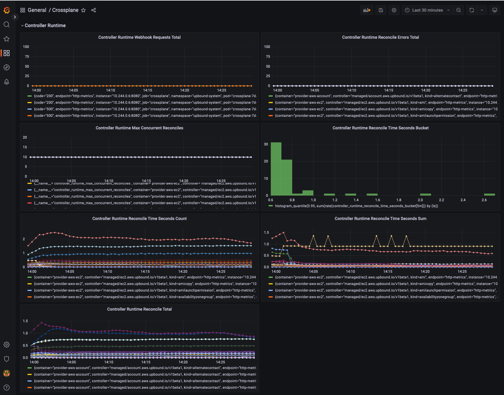

# configuration-observability-oss
Configuration to Set Up Crossplane, Provider and Resource Observability
with open source software integrations such as Prometheus and Grafana.

Observability is a measure of how well platform performance can be inferred
from knowledge of its metrics, logs and traces outputs.

## Purpose
The goal for configuration-observability-oss is to complement
other configurations such as configuration-caas. See the
[Upbound Marketplace](https://marketplace.upbound.io/) for
additional configurations.

## Usage
Run `make e2e` directly to exercise end to end tests
for the observability integrations. After running the
tests, the kind cluster will remain but the tests will
clean up the operator namespace and delete the pods in it
at the conclusion of the tests by default.

Apply the resource claim as follows to re-create
the namespace, Prometheus, Grafana and dependencies for further
exploration.
```
kubectl apply -f .up/examples/oss.yaml
```

To load dashboards that are part of this configuration repository,
please apply the following dashboard resource claims.
```
kubectl apply -f .up/examples/dashboards/folder-grafana.yaml
kubectl apply -f .up/examples/dashboards/dashboard-grafana-crossplane-health.yaml
kubectl apply -f .up/examples/dashboards/dashboard-grafana-crossplane-mr.yaml
kubectl apply -f .up/examples/dashboards/dashboard-grafana-crossplane-resources-ttr.yaml
kubectl apply -f .up/examples/dashboards/dashboard-grafana-crossplane-sli-metrics.yaml
```

Use the following to forward localhost:9090 to the Prometheus pod.
```
PROMETHEUS_POD_NAME=$(k -n operators get pods|\
    awk '{print $1}'|\
    tail +2|\
    grep prometheus-0)
kubectl -n operators port-forward ${PROMETHEUS_POD_NAME} 9090
```

Use the following to forward localhost:3000 to the Grafana pod.
```
GRAFANA_POD_NAME=$(k -n operators get pods|\
    awk '{print $1}'|\
    tail +2|\
    grep grafana)
kubectl -n operators port-forward ${GRAFANA_POD_NAME} 3000
```

Log in to Grafana at http://localhost:3000 with the credentials
obtained from running the following.
```
scripts/grafana-get-creds.sh
```

See example dashboards below.

#### Crossplane MR Dashboard


#### Controller Runtime Panels From Crossplane Dashboard


### Crossplane Observability In Action
Once your cluster has been bootstrapped, and that prometheus and grafana
endpoints have been forwarded, what's next?

Install a kubernetes secret with your provider credentials or use IRSA or
your own preferred way to provide the providers with the permissions to
create and reconcile cloud resources.

If you use AWS, One way would be to add your credentials to
`~/.aws/credentials`, and to run
```
kubectl create secret generic aws-creds \
    -n upbound-system \
    --from-file=credentials=~/.aws/credentials
```
Note that your shell may need a fully qualified path versus `~` above.

Apply a provider configuration as follows.
```
cat <<EOF | kubectl -f -
apiVersion: aws.upbound.io/v1beta1
kind: ProviderConfig
metadata:
  name: default
spec:
  credentials:
    source: Secret
    secretRef:
      namespace: upbound-system
      name: aws-creds
      key: credentials
EOF
```

Apply resource claims and see information on the
loaded dashboards. For example you can create an AWS VPC as follows, and
you can use your own compositions and any of our
[marketplace configurations](https://marketplace.upbound.io/configurations).

```
apiVersion: ec2.aws.upbound.io/v1beta1
kind: VPC
metadata:
  name: sample-vpc
  annotations:
    meta.upbound.io/example-id: ec2/v1beta1/vpc
spec:
  forProvider:
    region: us-west-1
    cidrBlock: 172.16.0.0/16
    tags:
      Name: SampleVpc
```

## Community
Feel free to join the [SIG Observability Slack Channel](https://crossplane.slack.com/archives/C061GNH3LA0)
to participate in the Crossplane observability journey.
